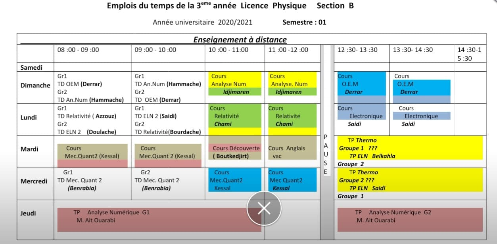

# **L3: Physique Fondamental Section B**
## **Contact Info**
| Module      | Prof de Cours|Prof de Td|
| ----------- | ----------- |-----------|
| Mécanique Quantique II      | Kessal <kessal_salem@yahoo.fr>|<ul><li>Gr1/Gr2: Benarbia <benrabia.djaafer@gmail.com>|
| Analyse Numérique   | Idjimaren <s.idjimarene@gmail.com>|<ul><li>Gr1/Gr2:Hammache</li></ul> |       
|Relativité Restreinte|Chami  <achami@usthb.dz>|<ul><li>Gr1:Azzouz </li><li>Gr2:Bourdache</li></ul>|
|Ondes électromagnétiques|Derrar <kaddourz@yahoo.com>|<ul><li>Gr1/Gr2:Derrar</ul>|
|Electronique II|Saidi <saidimohamedster@gmail.com>|<ul><li>Gr1: Saidi</li><li>Gr2: Doulache <m.khemici@univ-boumerdes.dz></li></ul>|
|Travaux Pratiques de Thermodynamique|/|/|
|TP Analyse Numérique|M.Ait Ouarabi <aitouarabi@gmail.com>|/|
|Découverte|Boutkedjirt <tarek.boutkedjirt@gmail.com>|/|

## **Links**
- [Facebook](https://www.facebook.com/groups/1561276947413528)
- [Discord](https://discord.gg/Zdts7G96)
- [Messanger]()
- [Drive de section B](https://drive.google.com/drive/u/0/folders/1hIvzDqkhTm4uiBDybATwgx_dLkVg20Kh?fbclid=IwAR3Tj_rWzVs5sinfKZcRKSwG2AqYpdbKmxUMk7-s5LekJ1tpSNMCPXWmAc8)
- [Drive de RR (2021-2022](https://drive.google.com/folderview?id=1EFRAG_fNhCzK0ZZPjbiivZ4b9uJKftnv)
- [Moodle de l'USTHB ](https://campusvirtuel.usthb.dz/)
- [Site de la faculté de physique](https://fphy.usthb.dz/)
- [Youtube channel RR](https://www.youtube.com/channel/UCoZZa93LKvH1jeV0If-n5nQ)
- [Youtube Channel](https://www.youtube.com/channel/UCoZZa93LKvH1jeV0If-n5nQ/featured)

## **Program**

